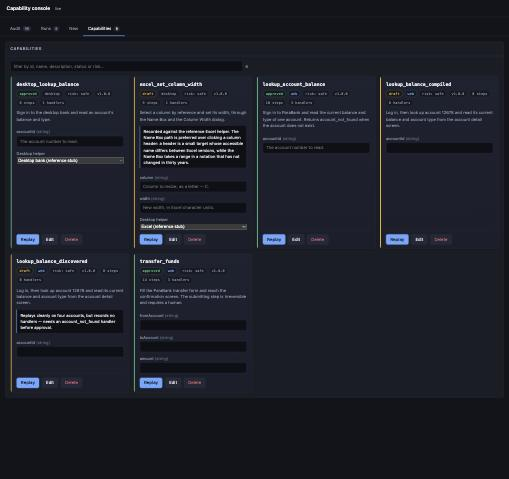

# Computer-Use Automation System

Compile an LLM-driven UI session into a typed capability, then replay it deterministically
without a model in the runtime loop.

Discovery uses a model once to learn a workflow. The resulting versioned JSON artifact can be
validated, reviewed, approved, and replayed with new inputs. Every replay records
`modelCalls: 0`.

The same artifact and replay engine support two surfaces:

- **Web:** Playwright drives ParaBank, the included demo target.
- **Desktop:** an accessibility-based helper protocol drives native applications. Reference
  banking and Excel helpers are included; production OS adapters are not.

For the design rationale and trade-offs, see [REPORT.md](REPORT.md). For implementation history,
see [PLAN.md](PLAN.md).

## Quick start

Requires Node.js 20+ and Docker.

```bash
npm install
npm run install:browsers
cp .env.example .env       # optional; defaults work as-is
./start.sh
```

This starts and seeds ParaBank, then launches the operator console.

| Service | Default URL |
|---|---|
| Operator console | <http://127.0.0.1:17080> |
| ParaBank | <http://localhost:18080/parabank> |

Useful scripts:

```bash
./start.sh                  # start ParaBank, seed fixtures, and run the console
./start.sh --no-console     # start only ParaBank and seed fixtures
./stop.sh                   # stop local services
./stop.sh --clean           # also remove ParaBank volumes
./logs.sh                   # follow ParaBank logs; add --console for console logs
```

`npm run install:browsers` is required because Playwright's Chromium binary is downloaded
separately from the npm package. On Linux or CI, use
`npx playwright install --with-deps chromium` instead.

The fixture database is reset on each start so demo runs stay reproducible. Use `--no-seed` to
preserve the current data.

| Fixture | Value |
|---|---|
| Login | `john` / `demo` |
| Savings account | `12678`, balance `-100.00` |
| Checking account | `12345`, balance `-2300.00` |
| Missing account | `99999` |

## Discover and replay

Discovery needs `ANTHROPIC_API_KEY` in `.env`. Replay, validation, and the committed examples do
not call a model.

```bash
# Discover a workflow and save it as a draft capability.
npm run cli -- discover \
  --goal "Log in, look up account 12678, and return its balance and account type" \
  --capability lookup_balance_discovered \
  --out capabilities/lookup_balance_discovered.v1.json \
  --input accountId=12678

# Replay that workflow with an input the model never saw.
npm run cli -- replay capabilities/lookup_balance_discovered.v1.json \
  --input accountId=12345
```

Replay returns one of four typed outcomes: `success`, `business_outcome`, `escalated`, or
`failure`. For example:

```bash
# Successful typed result.
npm run cli -- replay capabilities/lookup_account_balance.v1.json \
  --input accountId=12678

# Expected application outcome; exits 0 rather than reporting a system failure.
npm run cli -- replay capabilities/lookup_account_balance.v1.json \
  --input accountId=99999

# Input validation fails before a browser launches.
npm run cli -- replay capabilities/lookup_account_balance.v1.json \
  --input accountId=oops
```

## Human approval

Risky steps can pause for a person without handing the model control. The `transfer_funds`
capability fills the form automatically but marks submission as `approval_required`.

```bash
# Unattended: returns an escalation and resume token.
npm run cli -- replay capabilities/transfer_funds.v1.json \
  --input fromAccount=12345 --input toAccount=12678 --input amount=25

# Interactive: hands the live browser to the operator at the approval step.
npm run cli -- replay capabilities/transfer_funds.v1.json \
  --input fromAccount=12345 --input toAccount=12678 --input amount=25 \
  --interactive --headed --goal "move 25 dollars between demo accounts"
```

During handoff, the operator can:

- choose `done` after performing the step manually;
- choose `proceed` to let automation perform the approved step; or
- choose `abort` to stop the run.

An ownership lock prevents automation and the operator from acting at the same time. The run
records the handoff and field lengths, but not the text the operator entered.

## Operator console

```bash
npm run console
```

The local console can:

- list, review, edit, approve, and run capabilities;
- start web or desktop discovery runs;
- stream run events and show typed results;
- surface human-intervention requests; and
- summarize model usage and cost from the evidence ledger.



The console binds to `127.0.0.1` and has no authentication. It is a development and demo tool;
do not expose it to a network.

## Capability lifecycle and catalog

Capabilities move through `draft → validated → rehearsed → approved`. Approval applies to the
exact executable revision: behavioral edits require a version change and return the artifact to
`draft`.

```bash
npm run cli -- validate capabilities/lookup_account_balance.v1.json
npm run cli -- promote lookup_balance_discovered
npm run cli -- promote lookup_balance_discovered --by "sam"
npm run cli -- deprecate old_capability

npm run cli -- capabilities          # human-readable catalog, including drafts
npm run cli -- capabilities --json   # agent-facing catalog, approved only
npm run cli -- invoke lookup_account_balance --input accountId=12678
```

Promotion gates require durable locators and outputs, three clean rehearsals of the exact
artifact fingerprint, and a named human approver. `invoke` refuses drafts unless
`--allow-draft` is passed.

## Audit and evidence

Every run writes a directory under `evidence/` containing structured events, a typed result,
and relevant screenshots or failure context.

```bash
npm run cli -- audit
npm run cli -- audit --json
```

Discovery records model calls, tokens, and computed cost. Replay records zero model calls. The
evidence layer redacts configured secrets from JSON and masks sensitive fields before screenshots
are captured. Playwright traces are disabled by default because they may contain request bodies,
cookies, and DOM snapshots.

See [evidence/examples](evidence/examples) for committed sample runs.

## Safety model

Replay is constrained at three layers:

1. The capability declares target, risk, inputs, steps, handlers, and checkpoints.
2. Policy limits origins or applications, documents, routes, actions, risk classes, step count,
   and runtime.
3. The surface requires a target to resolve to exactly one visible element and verifies
   postconditions before continuing.

The engine stops instead of guessing. It never retries a successful side-effecting action such
as a click, fill, or select when its postcondition cannot be verified.

Example policies live in [`policies/`](policies). To see a policy denial:

```bash
npm run cli -- replay capabilities/lookup_account_balance.v1.json \
  --input accountId=12678 --policy policies/read-only.json
```

## Desktop capabilities

Desktop replay uses a newline-delimited JSON protocol between the TypeScript engine and a
platform helper. This repository implements the protocol, transport, accessibility snapshots,
policy checks, and replay surface. The included helpers model applications for tests and demos;
real macOS AXUIElement, Windows UI Automation, or AT-SPI2 adapters are outside the project.

```bash
# Reference desktop banking helper.
DESKTOP_APP_PASSWORD=hunter2 npm run cli -- replay \
  capabilities/desktop_lookup_balance.v1.json \
  --input accountId=12678 \
  --policy policies/desktop.json \
  --desktop-helper "node scripts/desktop-helper-stub.mjs"

# Reference Excel helper.
npm run cli -- replay capabilities/excel_set_column_width.v1.json \
  --input column=C --input width=20 \
  --policy policies/excel.json \
  --desktop-helper "node scripts/excel-helper-stub.mjs" \
  --allow-draft
```

Console-visible helpers are allowlisted in [`helpers.json`](helpers.json). The browser chooses a
helper name; the server owns its command, arguments, and policy.

## Architecture

```text
goal + skills + application memory + observation
                       │
                       ▼
                 LLM discovery
                       │
                       ▼
             typed capability artifact
                       │
          validate → rehearse → approve
                       │
                       ▼
          deterministic replay (0 model calls)
                       │
                       ▼
    success | business outcome | escalation | failure
```

Key modules:

| Path | Responsibility |
|---|---|
| `src/discovery.ts` | Model-driven capability recording |
| `src/replay.ts` | Deterministic artifact interpreter |
| `src/schema.ts` | Typed contracts for artifacts, policies, and results |
| `src/surface.ts` | Shared surface interface and Playwright implementation |
| `src/desktop/` | Desktop helper protocol, transport, and surface |
| `src/safety.ts` | Policy enforcement and budgets |
| `src/handoff.ts` | Ownership lock and intervention channels |
| `src/evidence.ts` | Events, screenshots, results, and model-call accounting |
| `src/catalog.ts` | Agent-callable capability catalog |
| `src/console/` | Local operator console |

Skills in [`skills/`](skills) and application memory in [`memory/`](memory) are inputs to
discovery only. The import-graph tests ensure neither can affect deterministic replay.

## Development

```bash
npm run setup       # reset and verify the ParaBank fixtures
npm test            # unit and browser tests
npm run typecheck   # TypeScript checks
npm run probe       # development harness for the surface layer
```

`npm run probe` is a development aid, not the product CLI. It exercises the live surface and
writes a representative evidence directory.

More detail:

- [REPORT.md](REPORT.md) — architecture, guarantees, and trade-offs
- [PLAN.md](PLAN.md) — implementation plan and acceptance criteria
- [docs/DAY0-FINDINGS.md](docs/DAY0-FINDINGS.md) — ParaBank findings that shaped the design
- [evidence/examples/README.md](evidence/examples/README.md) — sample run evidence
